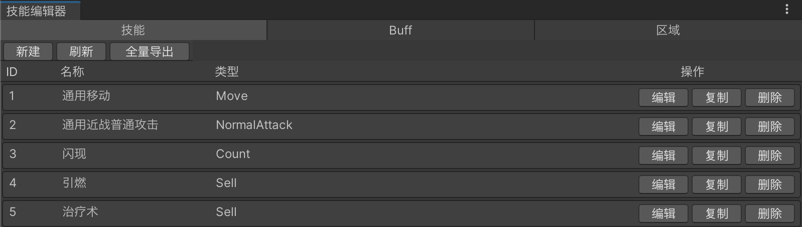
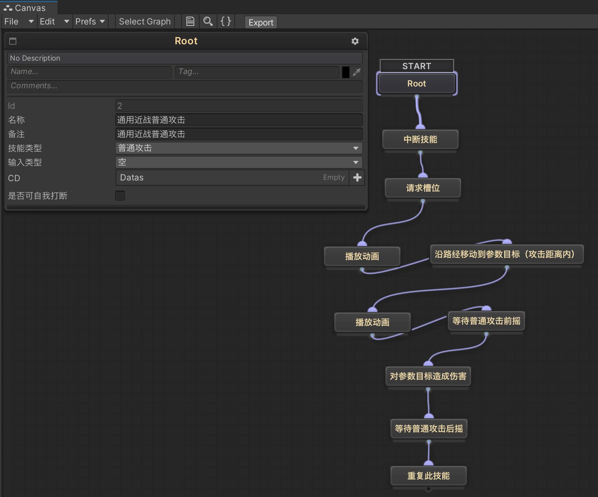
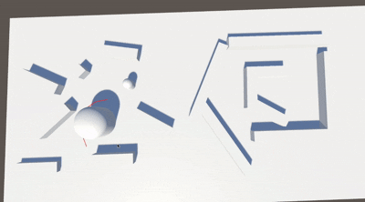
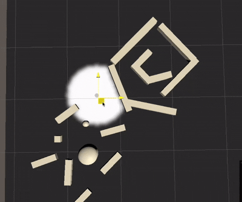
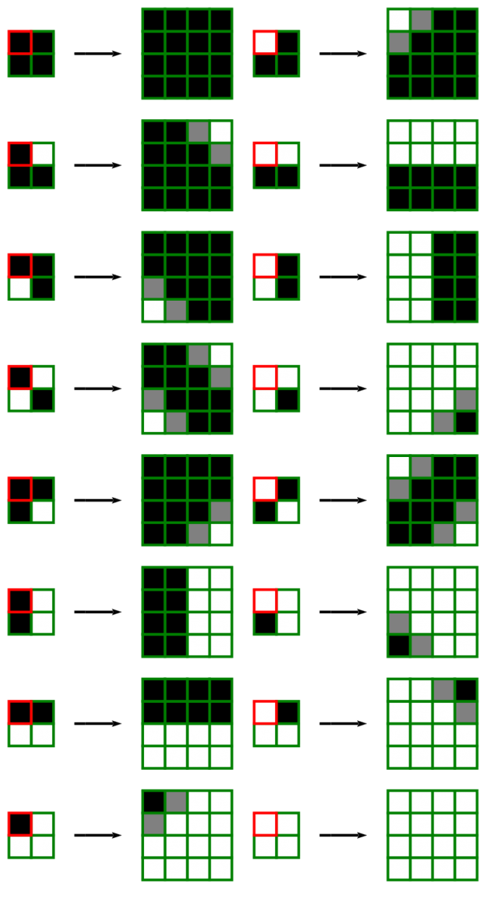

本项目以帧同步为基础搭建 MOBA 类型游戏原型，验证 MOBA 战斗中的技能系统、Buff 系统、战争迷雾等核心机制。

客户端使用 Unity 开发，战斗逻辑使用定点数运行，并通过 lockstep 保证不同客户端在相同输入下得到一致结果；服务端不计算具体战斗结果，仅负责收集输入并广播帧数据，使用 TCP + Protobuf 通信。由于帧同步具有确定性，客户端仅需依赖每一帧的输入数据，即可完整还原当前场景状态。

## 部署与运行

### 环境要求

- Unity `2022.3.41f1` 以上
- .NET SDK 9.0

### 启动服务端

在仓库根目录执行：

```bash
dotnet restore Server/Server.sln
dotnet build Server/Server.sln
dotnet run --project Server/Server.csproj --config Server/Config/Config/
```

服务端配置位于 `Server/Config/Config/network.json`。服务端以 `frame_per_second` FPS 推进帧同步，并在  `auto_start_count` 名玩家加入并选择英雄后自动开始对局。

### 运行客户端

1. 打开 "Scene/Main" 场景，修改 "Main" 节点下的 "GMTool" 服务器地址、服务器端口 
2. 使用 “工具/Unity 多开” 创建两个 Unity 项目 或 打包后，运行 `frame_per_second` 个客户端实例。
3. 等待所有客户端选择角色后自动开始对局。

## 项目结构

客户端入口为 `Client/Assets/Scripts/StartUp/Main.cs`，由 `GameMgr` 统一完成各功能系统的注册、初始化与生命周期调度。

为了保证帧同步战斗的一致性，所有会影响战斗结果的逻辑均采用定点数计算，使不同客户端在接收相同输入时能够得到一致的运行结果。开发过程中应使用 `FloatF` 代替浮点数，使用 `Vector3F` 代替 `Vector3`。

战斗场景中的实体角色，如英雄、小兵和防御塔，统一抽象为 `Actor`。`Actor` 本身主要负责承载状态和关联场景对象，移动、技能、动画播放等具体能力则通过挂载不同的 `Com` 组件实现。

角色身上的持续性状态和效果统一抽象为 `Buff`，并由 `Actor` 挂载的 `BuffCom` 负责创建、更新和移除。一个 `Buff` 可以通过配置组合多个 `Effect`，从而实现属性修改、播放动画等不同效果。

除角色实体外，战斗中的其他抽象对象通常统一抽象为 `Area`，例如 AOE 技能（只存活一帧的 Area）、投射物、陷阱。`Area` 一般由 `Actor` 创建，创建后交由 `AreaSystem` 统一管理；其具体行为同样采用配置驱动，通过组合不同的 `Effect` 实现。



## 网络同步

### 帧同步流程

1. 服务器按固定周期触发帧同步。
2. 每帧开始时，服务器广播 `frame_start_s2c`，通知客户端提交本帧操作，同时启动输入收集计时器。
3. 客户端收到 `frame_start_s2c` 后，将当前操作队列封装为 `frame_input_c2s` 并发送给服务器。
4. 满足以下任一条件时，服务器结束本帧输入收集：
   - 已收到所有玩家的 `frame_input_c2s`
   - 输入收集计时器超时
5. 服务器合并本帧收集到的输入，生成 `frame_input_s2c` 并广播给所有客户端。

### 输入超时处理

网络质量较差时，客户端的 `frame_input_c2s` 可能无法及时到达服务器。

假设服务器当前正在处理第 `n` 帧，却收到某个客户端属于第 `n - x` 帧的输入：

- 当 `x <= frame_max_delay` 时，将该输入补偿合并到第 `n` 帧；
- 当 `x > frame_max_delay` 时，认为该输入已超过最大容忍延迟，直接丢弃。

该机制允许一定范围内的输入延迟，同时避免过期输入对当前战斗状态造成影响。

### 断线重连处理

客户端重连后，通过 `frame_reconnect_c2s` 请求缺失的帧数据。

如果客户端没有退出，仅发生网络中断，则请求参数 `frame` 为 [客户端已收到的最大 `frame_input_s2c` 帧号] + 1，服务器收到请求后，将从该帧开始到当前最新帧的所有 `frame_input_s2c` 依次发送给客户端。客户端按帧重放这些输入，使本地战斗状态追赶至服务器当前进度。

如果客户端退出后再重连，发送参数是 1 的  `frame_reconnect_c2s`，请求全量数据即可。

## 战斗模块

由于 MOBA 游戏的战斗机制具有较高的多样性与复杂度，需要一套足够灵活、可扩展的行为系统来支撑各类战斗逻辑。本项目采用**技能树 + 行为机**的方式实现战斗行为：英雄的移动、普通攻击、技能释放等行为统一由技能树驱动；小兵、野怪等中立单位的自主决策与行动逻辑则由行为机驱动。

### 技能树

MOBA 游戏中的英雄拥有各式各样的技能。多数技能的执行过程都类似一条带有分支的 Timeline：从代码角度看，可以将它理解为一段支持 `yield` 的流程函数，而流程中的许多操作又可以抽象为通用节点。基于这一特点，便有了“技能树”这种实现方式。

技能树本质上是一种简化的行为树。它同样采用树状结构进行配置，但节点类型更加精简，主要分为执行节点和判断节点。每个英雄技能都对应一棵技能树；释放技能时，系统从根节点开始，按照配置顺序依次执行节点。通常只有判断节点可以拥有多个子节点，用于控制后续执行分支。

每个节点都具有完整的生命周期：

- `OnEnter`：进入节点时调用。
- `OnUpdate`：节点执行期间持续调用。
- `OnExit`：退出节点时调用。
- `OnFinish`：所在技能树成功执行结束时调用。
- `OnFail`：所在技能树执行失败时调用。

当任意节点执行失败时，整棵技能树都会立即中断。例如，技能执行到“寻路至指定位置”节点时，如果目标位置不在可寻路区域内，该节点便会执行失败。失败发生后，系统会依次调用该节点所有祖先节点的 `OnFail`。

如果技能树成功执行完成，则会在退出时调用所有已执行节点的 `OnFinish`。

在 MOBA 游戏中，鼠标右键通常用于移动或普通攻击。这两种行为可以分别实现为独立的技能树。普通攻击的技能树如下



技能之间通常还存在相互打断和预输入的需求。类似动作游戏中的技能衔接机制，这类功能可以通过“中断技能树”和 `SlotCom` 槽位组件共同实现。

技能树执行到“请求槽位”节点时，会尝试占用指定槽位。请求成功后，该槽位会持续被当前技能占用，直至技能执行结束。其他需要使用同一槽位的技能，必须等待槽位释放后才能继续执行。

假设技能 A 正在执行，此时玩家按下技能 B。如果 B 允许打断 A，例如普通动作类技能可以打断普通攻击，那么只需要在 B 的“请求槽位”节点之前配置一个“中断技能”节点，令其终止属于“普通攻击类”的技能树。A 被中断并释放槽位后，B 就可以继续申请槽位并执行后续流程。

预输入同样可以通过槽位机制实现。例如，某个英雄支持 EQ 连招：玩家可以在 E 尚未执行结束时提前按下 Q，并在 E 结束后自动释放 Q。实现时，只需要为 Q 的“请求槽位”节点配置足够长的等待时间。当 Q 执行到该节点时，如果槽位仍被 E 占用，便会进入等待状态；E 的技能树执行完成并释放槽位后，Q 即可成功获取槽位，继续执行后续节点。

允许在移动过程时释放的技能同样可以通过 `SlotCom` 来实现，移动的技能树占用下半身槽位，技能占用上半身槽位，两个技能树同时运行即可。

### 行为机

参考 ET 框架中的行为机机制<a id="ref-4-source"></a><sup><a href="#ref-4">[4]</a></sup>，本项目实现了一套用于控制中立角色的简易 AI 行为控制器。

一个行为机由多个相互排斥的行为组成，同一时刻只能执行其中一个行为。每个行为都具有独立的优先级。每帧更新时，行为机会按照优先级从高到低依次判断各个行为是否满足执行条件；一旦找到可执行的行为，便立即执行该行为，并停止检查后续行为。因此，高优先级行为可以随时打断当前正在执行的低优先级行为。

在 ET 框架中，每个行为由一个协程负责驱动；本项目则采用逐帧 `Update` 的方式实现。每个行为包含以下生命周期方法：

1. `Evaluate`：判断当前帧是否满足该行为的执行条件。
2. `Execute`：执行该行为的具体逻辑。
3. `OnStart`：切换到该行为时，在其开始执行的第一帧调用。
4. `OnAbort`：该行为被其他行为打断或切换时调用。

以 MOBA 游戏中的小兵为例，其行为机可以由以下三个行为组成，优先级从高到低依次为：

1. **攻击行为**：当攻击范围内存在敌方单位时，对目标执行普通攻击。
2. **追击行为**：当索敌范围内存在敌方单位时进入追击状态，并持续追击，直到目标超出追击距离。
3. **寻路行为**：沿预先配置的兵线航点（Waypoint）移动。

默认情况下，小兵会沿着预设的兵线路径移动。当敌方单位进入索敌范围后，小兵将切换至**追击行为**并向目标移动；当目标进入攻击范围时，优先级更高的**攻击行为**会打断当前的追击行为，使小兵停止移动并对目标进行普通攻击。

（实际游戏中的小兵 AI 通常还需要处理仇恨转移等情况，因此需要包含更多行为。）

## 寻路模块

帧同步对确定性要求较高，Unity 原生 NavMesh 难以保证不同平台下的计算结果完全一致。因此，本项目基于 `FloatF` 和 `Vector3F` 实现了一套简易的二维多边形寻路系统，通过 A* 算法完成多边形通道搜索，并结合漏斗算法<a id="ref-6-source"></a><sup><a href="#ref-6">[6]</a></sup>生成最短路径。

静态寻路网格来源于 Unity NavMesh。编辑器会将烘焙后的网格数据转换为 `FloatF` 格式并导出为 JSON，供游戏运行时加载和使用。针对不同体型的单位，项目会预先烘焙多套不同 Agent 半径的网格数据；实际寻路时，根据当前单位的碰撞半径，选择半径不小于该单位且最接近的网格。

对于运行过程中产生的单位及其他动态障碍物，则通过 RVO 算法实现局部动态避障。



## 战争迷雾

在 MOBA 游戏中，视野是战略博弈的核心要素，战争迷雾也会 Actor、Area 等多个系统。本项目实现了战争迷雾与单位可见性系统，核心流程如下：

1. 将地图划分为 128 * 128 的网格，并在运行时维护每个网格的可见状态。
2. 将网格可见性写入迷雾纹理，由地图材质的 Shader 采样该纹理并渲染阴影，从而呈现战争迷雾效果。
3. Actor 和 Area 等对象的可见性，则根据其所在网格的可见状态进行判断。



由于地图范围较大，直接使用 128 * 128 的纹理进行渲染，会产生明显的模糊和网格感，视野边缘的变化也不够自然。因此，在生成迷雾纹理时进行了以下优化：

1. 采用特殊的纹理放大算法，将 128 * 128 的原始纹理放大至 512 * 512，具体放大方式如下图所示。（参考《英雄联盟》项目组分享的技术方案<a id="ref-7-source"></a><sup><a href="#ref-7">[7]</a></sup>）
2. 对放大后的纹理进行高斯模糊，使视野边缘更加平滑。
3. 将当前迷雾纹理与上一帧纹理进行线性插值，使视野的显隐变化更加自然、连贯。



## Ref

1. <a id="ref-1"></a>[MMO技能系统](https://zhuanlan.zhihu.com/p/147681650)
2. <a id="ref-2"></a>[Lockstep 网络游戏同步方案](https://blog.codingnow.com/2018/08/lockstep.html)
3. <a id="ref-3"></a>[基于行为树的 MOBA 技能系统：技能系统与可视化节点技能编辑器](https://www.lfzxb.top/nkgmoba-visualnodeeditor-skill/)
4. <a id="ref-4"></a>[ET AI 框架——行为机](https://github.com/egametang/ET/blob/release6.0/Book/6.2AI%E6%A1%86%E6%9E%B6-%E8%A1%8C%E4%B8%BA%E6%9C%BA.md) [↩](#ref-4-source)
5. <a id="ref-5"></a>[虚幻引擎 NavMesh 导航寻路系统原理机制源码剖析](https://zhuanlan.zhihu.com/p/691181077)
6. <a id="ref-6"></a>[游戏寻路之平滑路径——拉绳（漏斗）](https://blog.csdn.net/romantic_jie/article/details/114012756) [↩](#ref-6-source)
7. <a id="ref-7"></a>[A Story of Fog and War](https://www.riotgames.com/en/news/story-fog-and-war) [↩](#ref-7-source)
8. <a id="ref-8"></a>[游戏中的战争迷雾](https://blog.csdn.net/xoyojank/article/details/12259161)
